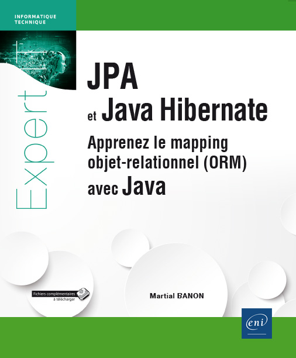

= JPA / Hibernate
Rémi PICARD <picard.remi@gmail.com>
:website: http://remi-picard.herokuapp.com/
:lang: fr
:source-highlighter: highlightjs
:highlightjs-theme: reveal.js/lib/css/atelier-seaside-dark.css
:revealjs_history: true
:revealjs_theme: white
:revealjs_slideNumber: true
:revealjs_mouseWheel: true
//http://grecko.themerex.net/wp-content/uploads/2014/04/9435123826_a4c3b35c08_o.jpg
:revealjs_parallaxBackgroundImage: assets/ballons.jpg
//:revealjs_parallaxBackgroundImage: http://grecko.themerex.net/wp-content/uploads/2014/02/portfolio_item.jpg
:revealjs_parallaxBackgroundSize: 1920px 1280px

Mapping objet-relationnel avec Java

== Présentation

=== ORM
* **O**bject-**R**elational **M**apping
* Abstraction d'une base de données relationnelle
* Le développeur ne manipule que des objets

=== JPA
* **J**ava **P**ersistent **A**PI = Standard JEE
** Structuration des données
** Gestion accès base de données
** Interrogation des données
* Inspiré des EJB Entity

=== Hibernate
* Implémentation de JPA (« provider »)
* RedHat / JBoss
* Début années 2000
* Autres implémentations (EclipseLink, OpenJPA)

== Concepts

=== Entité
* Objet Java à sauvegarder

[source,java]
----
import javax.persistence.*; //Import JPA
@Entity //Annotation
@Table(name = "personne") //Détails table en base de données
public class Personne {
    @Id
    private Integer id;

    @Basic
    private String firstName;
    @Basic
    private String lastName;

    // données Java simples, valeurs multiples ...

    public Personne() { }
}
----

=== Connexion aux données
|===
| JPA | JBDC | Description

| EntityManagerFactory
| DriverManager
| Récupération de la connexion

| EntityManager 
| Connection
| Connexion
|===

[NOTE]
====
@PersistenceContext permet de récupérer l'EntityManager
====

=== Types de sessions
* RESOURCE_LOCAL => gérée par l'application (Java SE)
* JTA (**J**ava **T**ransaction **A**PI) => gérée par le serveur d'application (Java EE)

== Paramétrage

=== Mappings
* XML
** 1 seul fichier externe au code source
* Annotations
** + intuitive
** - verbeuse
** 1 seule partie à maintenir

=== Paramétrage ORM
* persistence.xml, hibernate.properties
** Unité de persistance
** Framework utilisé par JPA
** Entités à mapper
** Driver / URL / Login / Mot de passe d'accès à la base de données 

== Interrogation des données
=== SQL natif
[source,java]
----
Query q = em.createNativeQuery("SELECT p.id,p.nom "
                            + "FROM Personne p "
                            + "WHERE p.id = 1", Personne.class);
Personne resultat = (Personne) q.getSingleResult();
----

=== JPQL
* **J**ava **P**ersistence **Q**uery **L**anguage

[source,java]
----
Query q = em.createQuery("SELECT p "
                        + "FROM Personne p "
                        + "WHERE p.id = 1", Personne.class);
Personne resultat = q.getSingleResult();
----

=== Requêtes nommées
[source,java]
----
@Entity
@NamedQueries({
    @NamedQuery(name="Personne.findById",
                query="SELECT p.id,p.nom "
                    + "FROM Personne p "
                    + "WHERE p.id = 1")
})
public class Personne { //... }
----

[source,java]
----
Personne p = em.createNamedQuery("Personne.findById", Personne.class)
               .setParameter("id", 1)
               .getSingleResult();
----

=== Requêtes « implicites »
[source,java]
----
Personne p = em.createQuery("SELECT p "
                        + "FROM Personne p "
                        + "WHERE p.id = 1", Personne.class)
               .getSingleResult();
p.getTelephones(); //Requête « implicite » ICI
----

=== API Criteria

[source,java]
----
//Création requête
CriteriaQuery cq = em.getCriteriaBuilder().createQuery(Personne.class);
Root<Personne> r = cq.from(Personne.class);
cq.select(r);

//Exécution
List<Personne> personnes = em.createQuery(cq).getResultList();
----

=== API Criteria - Avantages
* Typage
* Construction dynamique

== Définition Entité

=== Clefs primaires
@Id:: clef simple
@EmbeddedId:: clef composée via objet et constructeur

=== Valeurs générées

=== Valeur fixe
[source,java]
----
@Column(columnDefinition="default '10'")
----

=== Valeur incrémentielle
AUTO:: gérée par l'ORM, séquence unique pour tout le schéma (hibernate_sequence)
IDENTITY:: gérée par le SGBD (MySQL : AUTO_INCREMENT)
TABLE:: gérée par l'ORM, séquence par table (hibernate_sequence)
SEQUENCE:: séquence définie par le SGBD

=== Relations

*Intéractions* entre les entités.

=== Relation 1-1
* 1 objet composé avec 1 autre objet : 1 personne a un détail 
* Classe intégrable : ajout de colonnes dans table mère

[source,java]
----
@Entity
public class Personne {
    @Embedded
    private PersonneDetail personneDetail; // Composition avec un objet
}
----

=== Relation 1-1
@OneToOne : stockage dans 2 tables différentes

[source,java]
----
@Entity
public class Personne {
    @OneToOne //Mapping
    @JoinColumn(name = "id_personne") // Clef étrangère
    private PersonneDetail personneDetail; // Composition avec un objet
}
----

=== Relation 1-n
* @OneToMany 
* 1 objet composé avec 1 liste d'objets
* 1 personne a plusieurs téléphones

[source,java]
----
@Entity
public class Personne {
    @OneToMany //Mapping
    @JoinColumn(name = "personne_id") //Clef étrangère
    private List<Telephone> telephoneList;//Composition avec une liste de téléphones
}
----

=== Relation n-n
* @ManyToMany : valeur *multiple des 2 côtés* de la relation 
* 1 même langue est parlée dans plusieurs pays
* 1 pays a plusieurs langues parlées

[source,java]
----
@Entity
public class Langue {

    @JoinTable(name = "pays_langue", joinColumns = {
        @JoinColumn(name = "id_langue", referencedColumnName = "id")}, inverseJoinColumns = {
        @JoinColumn(name = "id_pays", referencedColumnName = "id")})
    @ManyToMany
    private List<Pays> paysList;
}
----

=== Relation n-n avec données sur la jointure
[source,java]
----
@Entity
public class PersonneAdresse {
    @Basic(optional = false)
    @Column(name = "principale")
    private boolean principale;
    @JoinColumn(name = "id_adresse", referencedColumnName = "id", insertable = false, updatable = false)
    @ManyToOne(optional = false)
    private Adresse adresse;
    @JoinColumn(name = "id_personne", referencedColumnName = "id", insertable = false, updatable = false)
    @ManyToOne(optional = false)
    private Personne personne;
}
@Entity
public class Personne {
    @OneToMany(cascade = CascadeType.ALL, mappedBy = "personne")
    private List<PersonneAdresse> personneAdresseList;
}
@Entity
public class Adresse {
    @OneToMany(cascade = CascadeType.ALL, mappedBy = "adresse")
    private List<PersonneAdresse> personneAdresseList;
}
----

=== Directions
* Unidirectionnelle : @OneToMany *OU* @ManyToOne
* Bidirectionnelle : @OneToMany *ET* @ManyToOne

[source,java]
----
@Entity
public class Personne {
    @OneToMany(mappedBy = "idPersonne")
    private Collection<Telephone> telephoneList; //List, Set ...
}
@Entity //Entité propriétaire de la relation
public class Telephone {
    @JoinColumn(name = "id_personne", referencedColumnName = "id")
    @ManyToOne
    private Personne idPersonne;
}
----

WARNING: Une relation bidirectionnelle est plus compliquée à maintenir

=== Converter
* Converti d'un type de données à un autre.
* JSON/Objet, XML/Objet ...

== Manipulation des données

=== Transaction

[source,java]
----
EntityTransaction tr = em.getTransaction();
try {
    // Début de la transaction
    tr.begin();

    // Exécution des requêtes...

    //Validation de la transaction
    tr.commit();
} catch (Exception e) {
    //Annulation de la transaction
    tr.rollback();
}
----

=== Méthodes JPA - Récupération
* find()
** Recherche via clef primaire
** Retourne null si non trouvée
* getReference()
** Chargement différé
** EntityNotFoundException si non trouvée

=== Type de chargement des données
* « fetch type »
* EAGER : charge entités reliés au moment du *chargement de l'entité principale*.
* LAZY : charge les relations entre les entités au moment de la *1ère exécution du getter*.

=== EAGER VS LAZY 
* LAZY évite une surconsommation mémoire
* LAZY oblige que l'EntityManager soit toujours actif

WARNING: Si l'EntityManager n'est plus actif, on obtient la célèbre LazyInitializationException.

=== Chargement par défaut
|===
|Type |Chargement

|@Basic
|EAGER

|@OneToOne
|EAGER

|@ManyToOne
|EAGER

|@OneToMany
|LAZY

|@ManyToMany
|LAZY
|===

=== Entité managée / non managée
Managée:: présente dans le contexte de persistence = récupérée/créée par EntityManager
Non Managée:: récupérée en dehors du contexte de persistence / transaction OU créée par constructeur

L'entité est-elle managée ?
[source,java]
----
em.contains(entity)
----

=== Méthodes JPA - Sauvegarde / Modification
* persist() : crée ou met à jour une *entité managée*.
* merge() : crée ou met à jour une *entité NON managée* ET retourne une entité managée.

=== Méthodes JPA - Suppression
* remove() : supprime une entité managée

WARNING: En cas de relations existantes, il faut également supprimer les liens entre les entités.

=== Opérations en cascade
* Concerne [@OneToOne, @OneToMany, @ManyToMany]
* Option cascade=CascadeType...
* CascadeType.ALL = [DETACH, MERGE, PERSIST, REMOVE, REFRESH]

=== Méthodes JPA - Synchronisation
flush():: Force la sauvegarde de l'entité en base (avant la fin de la transaction)
refresh(entity):: Raffraichissement de l'entité (depuis le dernier persist)

== API Criteria

=== 5 parties
* Type d'opération (SELECT, UPDATE, DELETE)
* Scope / Périmètre (FROM + JOIN)
* Restrictions (WHERE)
* Regroupement (GROUP BY + HAVING)
* Tri (ORDER BY)

=== API Metamodel
Metamodel:: Image des différentes entités utilisées
* Dynamique (par chaine de caractères) 
* Statique (code généré, Entity_) => typage des requêtes

=== Construction liste de critères
[source,java]
----
public List<Personne> rechercher(String nom, String prenom) {
    EntityManager em = getEntityManager();

    CriteriaBuilder cb = em.getCriteriaBuilder();
    CriteriaQuery<Personne> cq = cb.createQuery(Personne.class);

    Root<Personne> p = cq.from(Personne.class);

    List<Predicate> lstPredicate = new ArrayList<>();
    if (nom != null && !"".equals(nom.trim())) {
        lstPredicate.add(cb.like(p.get(Personne_.nom), nom.trim()));
    }
    if (prenom != null && !"".equals(prenom.trim())) {
        lstPredicate.add(cb.like(p.get(Personne_.prenom), prenom.trim()));
    }
    if (!lstPredicate.isEmpty()) {
        cq.where(lstPredicate.toArray(new Predicate[lstPredicate.size()]));
    }

    cq.select(p).distinct(true);
    return em.createQuery(cq).getResultList();
}
----

=== Jointure

* Join = jointure

NOTE: Condition de jointure personnalisable via méthode on()

* Fetch = jointure *AVEC* récupération de données

NOTE: Fetch extends Join

=== Multiselect
* Sélection des colonnes à retourner
* Evite de retourner tous les champs
* Retourne Objet[], Tuple, POJO

== Cycle de vie des données

=== Intercepteur / Evénements
* Interceptor (avant requête, avant commit)
[source,javascript]
----
hibernate.ejb.interceptor=
----

* Evénements
[source,java]
----
@Entity
public static class MyEntityWithCallbacks {
    @PrePersist void onPrePersist() {}
    @PostPersist void onPostPersist() {}
    @PostLoad void onPostLoad() {}
    @PreUpdate void onPreUpdate() {}
    @PostUpdate void onPostUpdate() {}
    @PreRemove void onPreRemove() {}
    @PostRemove void onPostRemove() {}
}
----

=== Cache
* Propre espace de mémoire pour stocker temporairement les données
* 2 niveaux de Cache : L1 et L2
* Entité dans L1 ? Entité dans L2 ? SQL

=== Cache de niveau 1 (L1)
* EntityManager
* Portée : Transaction

=== Cache de niveau 2 (L2)
* EntityManagerFactory
* Global à la JVM, réplicable sur plusieurs JVM
* JCache (EhCache, InfiniteSpan)
* Configurable (@Cacheable)

== Outils

=== Entités => Schéma
[source,javascript]
----
hibernate.hbm2ddl.auto=create
----

=== Génération MetaModel
pom.xml
[source,xml]
----
<dependency>
    <groupId>org.hibernate</groupId>
    <artifactId>hibernate-jpamodelgen</artifactId>
</dependency>
<!-- ... -->
<plugin>
    <artifactId>maven-compiler-plugin</artifactId>
    <configuration>
        <compilerArguments>
            <processor>org.hibernate.jpamodelgen.JPAMetaModelEntityProcessor</processor>
        </compilerArguments>
    </configuration>
</plugin>
----

== Choisir d'utiliser un ORM ou pas ?

|===
| + | -

| Projet de grande taille | Performances attendues
| Mixer avec et sans ORM | Perte de contrôle sur le SQL
|===

== Source
.JPA et Java Hibernate - Martial BANON, ENI éditions

== Questions